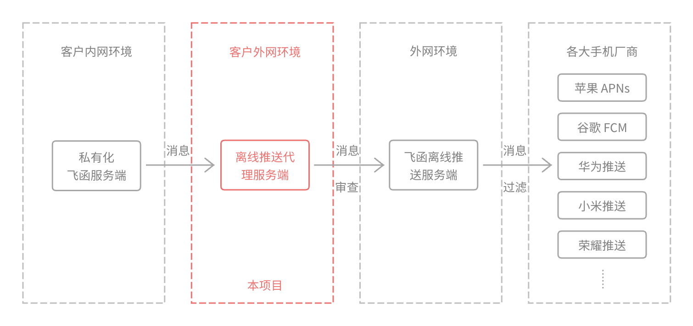

# 飞函离线推送代理服务端

简体中文 | [繁體中文](docs/README-zh-Hant.md) | [English](docs/README-en.md)



## 什么是离线推送？

当以下两种情况发生时，移动端 APP 无法与服务端建立通信：

- 用户将 APP 切至后台，手机系统通常会限制 APP 的活动，代码无法执行；
- 用户将 APP 进程结束。

此时服务端为了将消息及时推送至用户设备，需要将消息推送至不同手机厂商提供的推送服务，以实现系统级别的通知栏消息提醒。

这种 APP 离线情况下仍能推送消息的行为，称为「离线推送」。

飞函为了实现离线推送，为客户提供了「飞函离线推送服务」，该服务对接了不同手机系统的推送服务，这样做有两个优点：

- 对于客户：「私有化飞函服务端」仅需对接「飞函离线推送服务」即能实现离线推送，防火墙只需开放给一个服务；
- 对于飞函：可以隐藏掉对接手机厂商所需的敏感字段（AppKey、AppSecretKey 等），能统一过滤敏感词，为客户提供稳定的离线推送服务。

也有两个缺点：

- 对于客户：「私有化飞函服务端」需要暴露到外网，有安全风险。
- 对于客户：消息数据会经过「飞函离线推送服务」，有安全风险。

尽管飞函承诺，不会在「飞函离线推送服务」存储来自客户的消息数据，但始终无法打消客户顾虑，因此飞函做了以下两种措施，以帮助客户避免消息泄露：

- 在飞函管控台的「离线推送」的设置里，客户可以开启「隐藏消息内容」。开启之后，当消息数据传输出客户服务器之前，消息标题将变为「飞函」，消息内容将变为「您收到了x条消息」
- 飞函提供了一个开源的「离线推送代理服务端」，即本项目，客户可以自行编译部署。

## 本项目如何保证客户数据不泄露的？

本项目实现的功能非常简单：
- 接收来自客户内网「私有化飞函服务端」发来的「消息数据」；
- 审查「消息数据」不包含任何敏感的内容，也不包含任何除了「消息」以外的其他内容；
- 转发「消息数据」至「飞函离线推送服务」。

由于客户的「私有化飞函服务端」部署在内网，唯一的外网出口是客户自行部署的本项目，且因本项目的代码开源公开，客户可自行编译部署，所以从根源上杜绝了「私有化飞函服务端」可能“偷偷”传输些什么数据至外网的行为。

## 为什么飞函离线推送服务需要过滤敏感词？

上架的飞函 APP 只有一个，不同客户的用户都在使用该 APP，该 APP 对接了不同手机厂商的离线推送服务。一旦某个客户的用户有不合适的言论，手机厂商可能会禁用飞函 APP 的离线推送通道。

为了给所有客户提供稳定的离线推送服务，飞函需要将推送给手机厂商的消息内容进行敏感词过滤。

## 依赖

- Go 1.15 或更高版本
- Git

## 安装

1. 克隆仓库：
   ```sh
   git clone https://github.com/feihan-im/offline-push-proxy-server.git 
   cd offline-push-proxy-server
   ```

2. 安装依赖：
   ```sh
   go mod download
   ```

## 配置

您可以使用命令行参数来配置服务器：

- `-port`: 监听的端口（默认：21001）
- `-apiURL`: 转发请求的 API URL（默认：https://push-api.feihanim.cn ）

## 运行

使用默认参数运行：

```sh
go run main.go
```

指定自定义端口和 API URL：

```sh
go run main.go -port 8080 -apiURL https://custom-api.example.com 
```

## 特别感谢

本项目绝大部分代码由 [DeepSeek-Coder-V2](https://github.com/deepseek-ai/DeepSeek-Coder-V2) 生成，飞函团队在此向该项目致以诚挚的感谢。

## 开源协议

[Apache-2.0 License](./LICENSE)
