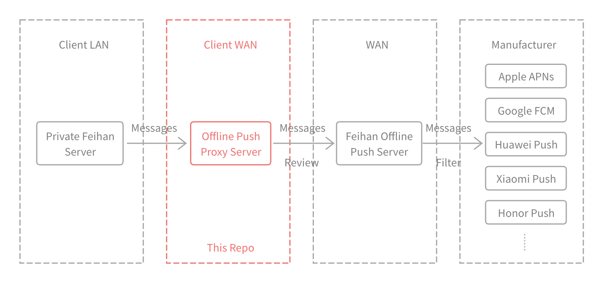

# Feihan Offline Push Proxy Server

[简体中文](../README.md) | [繁體中文](./README-zh-Hant.md) | English



## What is offline push?

When the following two situations occur, the mobile APP cannot establish communication with the server:

- The user switches the APP to the background, the mobile phone system usually restricts the APP's activities, and the code cannot be executed;

- The user terminates the APP process.

At this time, in order to push the message to the user's device in time, the server needs to push the message to the push service provided by different mobile phone manufacturers to realize the system-level notification bar message reminder.

This behavior of the APP still being able to push messages when it is offline is called "offline push".

In order to achieve offline push, Feihan provides customers with "Feihan Offline Push Service", which connects to the push services of different mobile phone systems. This has two advantages:

- For customers: "Private Feihan Server" only needs to connect to "Feihan Offline Push Service" to achieve offline push, and the firewall only needs to be opened to one service;

- For Feihan: sensitive fields (AppKey, AppSecretKey, etc.) required for connecting to mobile phone manufacturers can be hidden, sensitive words can be filtered uniformly, and stable offline push service can be provided to customers.

There are also two disadvantages:

- For customers: "Private Feihan Server" needs to be exposed to the external network, which poses a security risk.

- For customers: message data will pass through "Feihan Offline Push Service", which poses a security risk.

Although Feihan promised that it would not store message data from customers in "Feihan Offline Push Service", it has never been able to dispel customer concerns. Therefore, Feihan has taken the following two measures to help customers avoid message leakage:

- In the "Offline Push" setting of the Feihan control console, customers can turn on "Hide message content". After it is turned on, before the message data is transmitted to the client server, the message title will change to "Feihan" and the message content will change to "You have received x messages"
- Feihan provides an open source "offline push proxy server", that is, this project, which customers can compile and deploy by themselves.

## How does this project ensure that customer data is not leaked?

The functions implemented by this project are very simple:
- Receive "message data" sent from the "privatized Feihan server" in the customer's intranet;
- Review that "message data" does not contain any sensitive content, nor does it contain any content other than "message";
- Forward "message data" to "Feihan offline push service".

Since the customer's "privatized Feihan server" is deployed in the intranet, the only external network exit is this project deployed by the customer, and because the code of this project is open source and open to the public, customers can compile and deploy it by themselves, so the "privatized Feihan server" may "secretly" transmit some data to the external network.

## Why does Feihan offline push service need to filter sensitive words?

There is only one Feihan APP on the shelves, and users of different customers are using this APP. This APP is connected to the offline push services of different mobile phone manufacturers. Once a user of a certain customer makes inappropriate remarks, the mobile phone manufacturer may disable the offline push channel of Feihan APP.

In order to provide stable offline push services to all customers, Feihan needs to filter sensitive words in the message content pushed to the mobile phone manufacturer.

## Prerequisites

- Go 1.15 or higher
- Git

## Installation

1. Clone the repository:
    ```sh
    git clone https://github.com/feihan-im/offline-push-proxy-server.git
    cd offline-push-proxy-server
    ```

2. Install dependencies:
    ```sh
    go mod download
    ```

## Configuration

You can configure the server using command-line flags:

- `-port`: Port to listen on (default: 21001)
- `-apiURL`: API URL to forward requests to (default: https://push-api.feihanim.cn )

## Running the Server

To run the server with default settings:

```sh
go run main.go
```

To specify a custom port and API URL:

```sh
go run main.go -port 8080 -apiURL https://custom-api.example.com
```

## Special thanks

Most of the code in this project was generated by [DeepSeek-Coder-V2](https://github.com/deepseek-ai/DeepSeek-Coder-V2). The Feihan team would like to express their sincere gratitude to this project.

## Open Source License

[Apache-2.0 License](./LICENSE)
