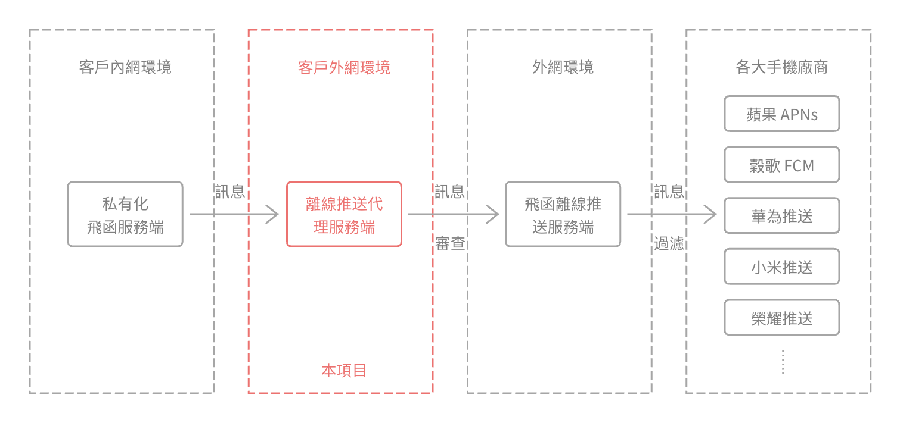

# 飛函離線推送代理服務端

[简体中文](../README.md) | 繁體中文 | [English](./README-en.md)



## 什麼是離線推送？

當以下兩種情況發生時，行動端 APP 無法與服務端建立通訊：

- 使用者將 APP 切至後台，手機系統通常會限制 APP 的活動，代碼無法執行；
- 使用者將 APP 進程結束。

此時服務端為了將訊息及時推送至用戶設備，需要將訊息推播至不同手機廠商提供的推播服務，以實現系統層級的通知欄訊息提醒。

這種 APP 離線情況下仍能推播訊息的行為，稱為「離線推播」。

飛函為了實現離線推送，為客戶提供了「飛函離線推送服務」，該服務對接了不同手機系統的推送服務，這樣做有兩個優點：

- 給客戶：「私有化飛函服務端」僅需對接「飛函離線推送服務」即能實現離線推送，防火牆只需開放給一個服務；
- 對於飛函：可以隱藏掉對接手機廠商所需的敏感欄位（AppKey、AppSecretKey 等），能統一過濾敏感詞，為客戶提供穩定的離線推播服務。

也有兩個缺點：

- 給客戶：「私有化飛函服務端」需要暴露到外網，有安全風險。
- 對於客戶：訊息資料會經過「飛函離線推送服務」，有安全風險。

儘管飛函承諾，不會在「飛函離線推送服務」中儲存來自客戶的訊息數據，但始終無法打消客戶顧慮，因此飛函做了以下兩種措施，以幫助客戶避免訊息洩露：

- 在飛函管控台的「離線推播」的設定裡，客戶可以開啟「隱藏訊息內容」。開啟之後，當訊息資料傳輸出客戶伺服器之前，訊息標題將變為“飛函”，訊息內容將變為“您收到了x一則訊息”
- 飛函提供了一個開源的「離線推送代理服務端」，即本項目，客戶可以自行編譯部署。

## 本專案如何保證客戶資料不外洩的？

本專案實現的功能非常簡單：
- 接收來自客戶內部網路「私有化飛函服務端」所發出的「訊息資料」；
- 審查「訊息資料」不包含任何敏感的內容，也不包含任何除了「訊息」以外的其他內容；
- 轉送「訊息資料」至「飛函離線推播服務」。

由於客戶的「私有化飛函服務端」部署在內網，唯一的外網出口是客戶自行部署的本項目，且因本項目的代碼開源公開，客戶可自行編譯部署，所以從根源上杜絕了「私有化飛函服務端」可能「偷偷」傳送些什麼資料至外網路的行為。

## 為什麼飛函離線推送服務需要過濾敏感字？

上架的飛函 APP 只有一個，不同客戶的用戶都在使用該 APP，該 APP 對接了不同手機廠商的離線推播服務。一旦某位客戶的使用者有不合適的言論，手機廠商可能會停用飛函 APP 的離線推播頻道。

為了提供所有客戶穩定的離線推播服務，飛函需要將推播給手機廠商的訊息內容進行敏感字詞過濾。

## 依賴

- Go 1.15 或更高版本
- Git

## 安裝

1. 克隆倉庫：
 ```sh
 git clone https://github.com/feihan-im/offline-push-proxy-server.git
 cd offline-push-proxy-server
 ```

2. 安裝依賴：
 ```sh
 go mod download
 ```

## 配置

您可以使用命令列參數來設定伺服器：

- `-port`: 監聽的連接埠（預設：21001）
- `-apiURL`: 轉送請求的 API URL（預設：https://push-api.feihanim.cn ）

## 運行

使用預設參數運行：

```sh
go run main.go
```

指定自訂連接埠和 API URL：

```sh
go run main.go -port 8080 -apiURL https://custom-api.example.com
```

## 特別感謝

本專案絕大部分程式碼由 [DeepSeek-Coder-V2](https://github.com/deepseek-ai/DeepSeek-Coder-V2) 生成，飛函團隊在此向專案致以誠摯的感謝。

## 開源協議

[Apache-2.0 License](./LICENSE)
